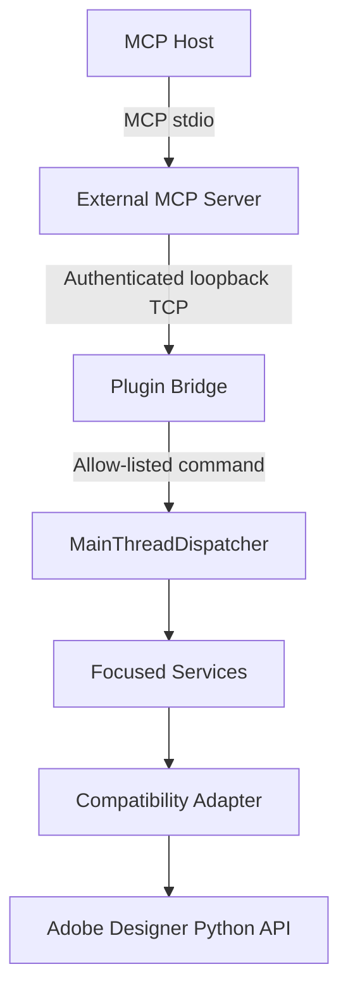

# Architecture

## Runtime boundary

The project has two separately installable runtimes:

1. `src/substance_designer_mcp`: Python 3.10+, official MCP SDK, stdio transport, no Adobe imports.
2. `sd_plugin/substance_designer_mcp_plugin`: Python 3.9-compatible source, standard library plus
   Designer/PySide6, no MCP SDK or Pydantic.

## Responsibilities

- Tool modules own descriptions, strict schemas, annotations, reference models, and bridge calls.
- `BridgeClient` owns discovery, framing, timeouts, and public error conversion.
- Plugin bridge owns loopback binding, authentication, request framing, response framing, and main
  thread dispatch. It treats command names and arguments as opaque data.
- Command registry owns the fixed allow-list, validation, confirmation, and write serialization.
- Services own application, package, graph, selection, node, connection, parameter, library,
  generic authoring, validated patch, bitmap import, and SBSAR delivery business logic. No tool or
  bridge class calls Adobe APIs.
- Compatibility owns version interpretation, runtime feature probes, concrete SD enums/base types,
  and simple SDValue constructors.

## Version interpretation

Version classification stays entirely in the Compatibility layer. Designer 16.0.3 reports
`verified` / `supported`. Other released 16.x versions report `untested` /
`capability_detected`; unknown newer major versions report `untested` / `experimental`; versions
below 16 or versions that cannot be identified report `untested` / `unsupported`. The external MCP
server and transport bridge only forward these fields and never infer compatibility themselves.

Runtime API availability controls individual tools. It does not turn an untested Designer version
into a verified or formally supported version.

## Data flow

Each MCP call becomes one bridge request with one UUID. The plugin validates the protocol and token
before command lookup, posts one job to Qt's main thread, serializes the result to plain JSON, and
returns one response. Writes are serialized by the registry. A timeout cancels a queued job if it
has not started; an already running Adobe call is allowed to finish on the main thread.

Graph Patch `1.0` is a bounded additive action schema. The plugin resolves every definition,
resource, parameter, and port before mutation; rejects duplicate target inputs and cycles; creates
only request-local aliases; and deletes all nodes created by the request if a runtime step fails.
It is not arbitrary code execution and does not edit or delete pre-existing nodes.

## Stable references

Package, graph, node, and library resource references contain only strings, numbers, booleans,
arrays, objects, and null. Node handles are explicitly scoped to the current Designer session.
Library stable keys omit temporary `dependency` query parameters; `runtime_url` is returned only for
diagnosis and current-session resolution.
